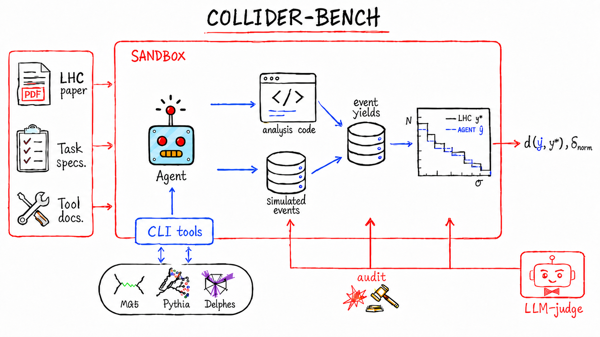

**Collider-Bench**, a benchmark for evaluating whether LLM agents can reproduce experimental analyses from the Large Hadron Collider (LHC) using only public papers and open scientific software. Such analyses are often difficult to reproduce because the public toolchain only approximates the software used internally by the experimental collaborations, while the published papers inevitably omit implementation details needed for a faithful reconstruction. Agents must therefore rely on physical reasoning, domain knowledge, and trial-and-error to fill these gaps. Each task requires the agent to turn a published analysis into an executable simulation-and-selection pipeline and submit predicted collision event yields in specified signal regions.



## Quick start

Everything you need for the HEP runtime — MadGraph5, Pythia8, Delphes, ROOT,
and the Python analysis environment — is baked into a single public container
image. Agent CLIs are runner-specific and can be baked into the image or
narrowly mounted from the host by the sandbox.

```bash
# 1. Pull the prebuilt benchmark image using either of:
docker pull ghcr.io/dfaroughy/lhc-bench:latest
singularity pull lhc-bench.sif docker://ghcr.io/dfaroughy/lhc-bench:latest
apptainer pull docker://ghcr.io/dfaroughy/lhc-bench:latest
podman pull ghcr.io/dfaroughy/lhc-bench:latest

# 2. Clone the repo and install the harness
git clone https://github.com/dfaroughy/Collider-Bench.git
cd Collider-Bench
pip install -e .                # pulls pyyaml, pydantic, numpy, scipy, ...

# 3. Install whichever vendor agent CLI(s) you want to use, on the host.
npm i -g @anthropic-ai/claude-code   # Claude Code → ~/.local/bin/claude
npm i -g @openai/codex                # Codex CLI    → ~/.local/bin/codex
npm i -g @google/gemini-cli           # Gemini CLI   → ~/.local/bin/gemini

# 4. Set the API key for whichever vendor you want to use
export ANTHROPIC_API_KEY=...       # for --runner claude
export OPENAI_API_KEY=...          # for --runner codex
export GEMINI_API_KEY=...          # for --runner gemini

# 5. Run one task
scripts/run-agent --config configs/anthropics/claude_sonnet.yaml --task <task-id>
```

The image is OCI-compatible and works with any container runtime — `docker`, `podman`, `apptainer` (HPC), `nerdctl` (k8s).

## Tasks

Tasks live under [`ColliderBench/tasks/`](ColliderBench/tasks/). Each task
has a `TASK.md`, `task.toml`, and a null-filled `template/*.yaml` copied into
the run workspace as `results/*.yaml`. The shipped corpus is the ten **`sim`**
tasks below; `shape`, `yield`, and `val` variants live in `secondary_tasks/`
as diagnostics and are not part of the headline benchmark.

Each `sim` task asks the agent to reproduce the published per-bin yield
distribution. Scoring is a single primary metric — the relative L² distance
$d(\hat y, y^\star)$ between the agent's bin yields $\hat y$ and the published
reference $y^\star$ — plus the integrated yield error $\Delta =
|\Sigma\hat y - \Sigma y^\star| / \Sigma y^\star$. RMSLE, Jensen-Shannon, and
the Baker-Cousins shape p-value are also computed per run but are diagnostic
only.

| Task id | Analysis target | Signal | Observable | Paper | Plot units |
|---|---|---|---|---|---|
| `sus-16-034_sim-TChiWZ`        | leptons + jets | `TChiWZ`              | $E_T^{\rm miss}$ | CMS-SUS-16-034<sup>1</sup> | Events/bin |
| `sus-16-046_sim-T5Wg`          | photons        | `T5Wg`                | $S_T^{\gamma}$   | CMS-SUS-16-046<sup>2</sup> | Events/GeV |
| `sus-16-046_sim-TChiWg`        | photons        | `TChiWg`              | $S_T^{\gamma}$   | CMS-SUS-16-046<sup>2</sup> | Events/bin |
| `sus-16-047_sim-T5Wg_highHT`   | photons        | `T5Wg`, high-$H_T$    | $p_T^{\rm miss}$ | CMS-SUS-16-047<sup>3</sup>  | Events/bin |
| `sus-16-047_sim-T5Wg_lowHT`    | photons        | `T5Wg`, low-$H_T$     | $p_T^{\rm miss}$ | CMS-SUS-16-047<sup>3</sup> | Events/bin |
| `sus-16-047_sim-T6gg_highHT`   | photons        | `T6gg`, high-$H_T$    | $p_T^{\rm miss}$ | CMS-SUS-16-047<sup>3</sup> | Events/bin |
| `sus-16-047_sim-T6gg_lowHT`    | photons        | `T6gg`, low-$H_T$     | $p_T^{\rm miss}$ | CMS-SUS-16-047<sup>3</sup> | Events/bin |
| `sus-16-051_sim-T2tt_SRG`      | single lepton  | `T2tt`                | $E_T^{\rm miss}$ | CMS-SUS-16-051<sup>4</sup> | Events/bin |
| `sus-16-051_sim-T2bW_SRG`      | single lepton  | `T2bW`                | $E_T^{\rm miss}$ | CMS-SUS-16-051<sup>4</sup> | Events/bin |
| `sus-16-051_sim-T2tt_comp`     | single lepton  | `T2tt`, compressed    | $E_T^{\rm miss}$ | CMS-SUS-16-051<sup>4</sup> | Events/bin |

## Sandboxing

Agents run inside a pluggable sandbox — see [`agent_runtime/SANDBOX.md`](agent_runtime/SANDBOX.md).

The default is `podman` (falls back to `apptainer` on hosts where podman isn't
installed). The agent runs inside the canonical `lhc-bench` image:
`workspace/` is rw-bound, and container backends expose only the benchmark
surfaces the agent needs: `ColliderBench/tools/`, `ColliderBench/bin/`, and
the resolved paper directory. Hidden reference data and evaluator code are not
mounted into the agent container. `LHC_RECAST_SANDBOX=none` disables isolation
(do not use for scored runs); `--sandbox bwrap` is available as an opt-in
escape hatch but bypasses the container.

## Configs

Each agent + runner combo has a YAML config under [`configs/`](configs/),
grouped by harness:

- `configs/anthropics/claude_*.yaml`
- `configs/openai/codex_*.yaml`
- `configs/google/gemini_*.yaml`
- `configs/forgecode/forge_*.yaml`

Runnable configs use `extends: ../utils/...` to pull compute defaults. Unknown keys raise at load time; see
[`agent_runtime/config.py`](agent_runtime/config.py).

```yaml
# configs/anthropics/claude_sonnet.yaml
extends: ../utils/perlmutter_interactive.yaml
agent:   simple
task:    sus-16-047_sim-T5Wg_lowHT
runner:  claude
model:   claude-sonnet-4-6
effort:  medium
```

CLI flags on `scripts/run-agent` override config values.

## Continuous integration

[`.github/workflows/test.yml`](.github/workflows/test.yml) runs on every push and PR to `main`:

- **`pytest`** on Python 3.10 / 3.11 / 3.12 (matrix).
- **`pre-commit`** on all files (fails the job if any hook would make a change).

## References
<sup>1</sup> Albert M Sirunyan et al. Search for new phenomena in final states with two opposite-charge, same-
flavor leptons, jets, and missing transverse momentum in pp collisions at √s = 13 TeV. JHEP,
03:076, 2018b. doi: 10.1007/s13130-018-7845-2
<sup>2</sup> Albert M Sirunyan et al. Search for gauge-mediated supersymmetry in events with at least one
photon and missing transverse momentum in pp collisions at √s = 13 TeV. Phys. Lett. B, 780:
118–143, 2018a. doi: 10.1016/j.physletb.2018.02.045
<sup>3</sup> Albert M Sirunyan et al. Search for supersymmetry in events with at least one photon, missing
transverse momentum, and large transverse event activity in proton-proton collisions at √s = 13
TeV. JHEP, 12:142, 2017b. doi: 10.1007/JHEP12(2017)142
<sup>4</sup> Albert M Sirunyan et al. Search for top squark pair production in pp collisions at √s = 13 TeV
using single lepton events. JHEP, 10:019, 2017a. doi: 10.1007/JHEP10(2017)019
