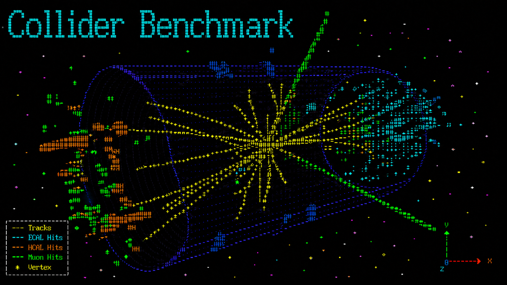

This is an agentic AI benchmark for reproducing and recasting analyses published by the experimental collaborations at CERN's Large Hadron Collider.

## Quick start

Everything you need for the HEP runtime — MadGraph5, Pythia8, Delphes, ROOT,
and the Python analysis environment — is baked into a single public container
image. Agent CLIs are runner-specific and can be baked into the image or
narrowly mounted from the host by the sandbox.

```bash
# 1. Pull the prebuilt benchmark image using either of:
docker pull ghcr.io/dfaroughy/lhc-bench:latest
singularity pull lhc-bench.sif docker://ghcr.io/dfaroughy/lhc-bench:latest
apptainer pull docker://ghcr.io/dfaroughy/lhc-bench:latest
podman pull ghcr.io/dfaroughy/lhc-bench:latest

# 2. Clone the repo and install the harness
git clone https://github.com/dfaroughy/Collider-Bench.git
cd Collider-Bench
pip install -e .                # pulls pyyaml, pydantic, numpy, scipy, ...

# 3. Install whichever vendor agent CLI(s) you want to use, on the host.
npm i -g @anthropic-ai/claude-code   # Claude Code → ~/.local/bin/claude
npm i -g @openai/codex                # Codex CLI    → ~/.local/bin/codex
npm i -g @google/gemini-cli           # Gemini CLI   → ~/.local/bin/gemini

# 4. Set the API key for whichever vendor you want to use
export ANTHROPIC_API_KEY=...       # for --runner claude
export OPENAI_API_KEY=...          # for --runner codex
export GEMINI_API_KEY=...          # for --runner gemini

# 5. Run one task
scripts/run-agent --config configs/claude_simple.yaml --task <task-id> 
```

The image is OCI-compatible and works with any container runtime — `docker`, `podman`, `apptainer` (HPC), `nerdctl` (k8s).

## Repository layout

```
agent_runtime/        — how we run agents (infra)
  runners.py            Runner ABC + registry
  runner_spec.py        Declarative runner specs + stream parsers
  vendors.py            Claude / Codex / Gemini / Aider / Forge runner specs
  sandbox.py            Pluggable Sandbox (podman, apptainer, bwrap, none). See SANDBOX.md.
  launch.py             Shared single-run scaffolding
  workspace.py          build_workspace(): per-run sandbox layout
  naming.py             Run-dir naming
  config.py             YAML config loading + validation
  effort.py             Effort label / token-budget parsing
  run_info.py           run_info.json finalization + usage accounting
  preflight.py          AST lint for analysis.py
  stream_display.py     stream-json → terminal renderer
  shell/agent_env.sh    Conda + Lmod + SLURM bootstrap

LHCRecastBench/       — what we test against (benchmark)
  tasks/                Task definitions, templates, and shared paper/reference data
  evaluation/           score.py, llm_judge.py, plot_recast.py, render_eval.py
  tools/                Agent-facing HEP libraries (streaming, sim helpers)
  bin/                  Agent-facing CLIs (hepdata, cms-opendata, read-paper, simulate)

agents/
  simple/               Single-shot: one LLM call, score. (Add your own pattern
                        here by creating a sibling directory + run.py.)

configs/              — YAML configs with `extends: base.yaml`
scripts/              — run-agent dispatcher, launch_eval.sh
tests/                — pytest smoke suite (offline, no SLURM, no LLM calls)
```

## Tasks

Tasks live under [`LHCRecastBench/tasks/`](LHCRecastBench/tasks/). Each task
has a `TASK.md`, `task.toml`, and a null-filled `template/*.yaml` copied into
the run workspace as `results/*.yaml`.

Task families:

- `sim`: reproduce the distribution shape and normalization.
- `shape`: reproduce only the distribution shape; normalization is not scored.
- `yield`: estimate the inclusive event yield only.
- `val`: reproduce validation data counts.

| Task id | Paper | Kind | Metric | Plot units |
|---|---|---|---|---|
| `exo-17-021_sim-RPVstop_res-btag` | CMS-EXO-17-021 | sim | shape+norm | Events/bin |
| `exo-17-021_sim-RPVstop_res-incl` | CMS-EXO-17-021 | sim | shape+norm | Events/bin |
| `sus-16-046_shape-T5Wg` | CMS-SUS-16-046 | shape | shape | Events/bin |
| `sus-16-046_shape-TChiWg` | CMS-SUS-16-046 | shape | shape | Events/bin |
| `sus-16-046_sim-T5Wg` | CMS-SUS-16-046 | sim | shape+norm | Events/GeV |
| `sus-16-046_sim-TChiWg` | CMS-SUS-16-046 | sim | shape+norm | Events/bin |
| `sus-16-046_val-Nobs` | CMS-SUS-16-046 | val | shape+norm | Events/bin |
| `sus-16-046_yield-T5Wg` | CMS-SUS-16-046 | yield | yield | Events/bin |
| `sus-16-046_yield-TChiWg` | CMS-SUS-16-046 | yield | yield | Events/bin |
| `sus-16-047_shape-T5Wg_highHT` | CMS-SUS-16-047 | shape | shape | Events/bin |
| `sus-16-047_shape-T5Wg_lowHT` | CMS-SUS-16-047 | shape | shape | Events/bin |
| `sus-16-047_shape-T6gg_highHT` | CMS-SUS-16-047 | shape | shape | Events/bin |
| `sus-16-047_shape-T6gg_lowHT` | CMS-SUS-16-047 | shape | shape | Events/bin |
| `sus-16-047_sim-T5Wg_highHT` | CMS-SUS-16-047 | sim | shape+norm | Events/bin |
| `sus-16-047_sim-T5Wg_lowHT` | CMS-SUS-16-047 | sim | shape+norm | Events/bin |
| `sus-16-047_sim-T6gg_highHT` | CMS-SUS-16-047 | sim | shape+norm | Events/bin |
| `sus-16-047_sim-T6gg_lowHT` | CMS-SUS-16-047 | sim | shape+norm | Events/bin |
| `sus-16-047_val-Nobs_highHT` | CMS-SUS-16-047 | val | shape+norm | Events/bin |
| `sus-16-047_val-Nobs_lowHT` | CMS-SUS-16-047 | val | shape+norm | Events/bin |
| `sus-16-047_yield-T5Wg_highHT` | CMS-SUS-16-047 | yield | yield | Events/bin |
| `sus-16-047_yield-T5Wg_lowHT` | CMS-SUS-16-047 | yield | yield | Events/bin |
| `sus-16-047_yield-T6gg_highHT` | CMS-SUS-16-047 | yield | yield | Events/bin |
| `sus-16-047_yield-T6gg_lowHT` | CMS-SUS-16-047 | yield | yield | Events/bin |
| `sus-16-051_shape-T2tt` | CMS-SUS-16-051 | shape | shape | Events/bin |
| `sus-16-051_shape-T2tt_comp` | CMS-SUS-16-051 | shape | shape | Events/bin |
| `sus-16-051_sim-T2tt` | CMS-SUS-16-051 | sim | shape+norm | Events/bin |
| `sus-16-051_sim-T2tt_comp` | CMS-SUS-16-051 | sim | shape+norm | Events/bin |
| `sus-16-051_yield-T2tt` | CMS-SUS-16-051 | yield | yield | Events/bin |
| `sus-16-051_yield-T2tt_comp` | CMS-SUS-16-051 | yield | yield | Events/bin |

## Sandboxing

Agents run inside a pluggable sandbox — see [`agent_runtime/SANDBOX.md`](agent_runtime/SANDBOX.md).

The default is `podman` (falls back to `apptainer` on hosts where podman isn't
installed). The agent runs inside the canonical `lhc-bench` image:
`workspace/` is rw-bound, and container backends expose only the benchmark
surfaces the agent needs: `LHCRecastBench/tools/`, `LHCRecastBench/bin/`, and
the resolved paper directory. Hidden reference data and evaluator code are not
mounted into the agent container. `LHC_RECAST_SANDBOX=none` disables isolation
(do not use for scored runs); `--sandbox bwrap` is available as an opt-in
escape hatch but bypasses the container.

## Configs

Each agent + runner combo has a YAML config under [`configs/`](configs/).
Configs use `extends: base.yaml` to pull shared compute defaults. Unknown keys
raise at load time; see [`agent_runtime/config.py`](agent_runtime/config.py).

```yaml
# configs/claude_simple.yaml
extends: base.yaml
agent:   simple
task:    sus-16-047_sim-T5Wg_lowHT
runner:  claude
model:   claude-opus-4-7
effort:  medium
```

CLI flags on `scripts/run-agent` override config values.

## Developer setup

After cloning:

```bash
pip install pre-commit
pre-commit install            # installs the git hook (one-time per clone)
```

From then on, every `git commit` runs the hooks in [`.pre-commit-config.yaml`](.pre-commit-config.yaml): whitespace cleanup, YAML validation, `ruff` lint + format, secrets scan. Commits with violations are rejected until fixed (most are auto-fixed in place — just `git add` and retry).

Ad-hoc run on the whole tree:

```bash
pre-commit run --all-files
```

## Continuous integration

[`.github/workflows/test.yml`](.github/workflows/test.yml) runs on every push and PR to `main`:

- **`pytest`** on Python 3.10 / 3.11 / 3.12 (matrix).
- **`pre-commit`** on all files (fails the job if any hook would make a change).

CI runners don't have `claude` / `codex` / `bwrap` installed; the tests that depend on them self-skip cleanly.
